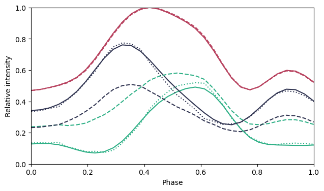

# Blind Source Separation for Decomposing X-ray Pulsar Profiles: Introducing Phase Correlated Variability Analysis (PCVA)
This repository contains a complete example of Phase Correlated Variability Analysis (PCVA) to decompose the pulse profiles of X-ray pulsars on simulated data. It accompanies the paper "Blind Source Separation for Decomposing X-ray Pulsar Profiles: Introducing Phase Correlated Variability Analysis (PCVA)", which is currently under review by the journal Astronomy & Astrophysis.

The main file is the Python Jupyter notebook `pcva-simulation-AA.ipynb`, which requires the file `smooth.py`, which in turn is licensed according to the contents of `LICENSE-smooth.txt`. The `environment.yml` file contains the environment with all packages and versions needed to run the notebook.

(Total pulse profile in red. Input of the simulation: solid blue and green lines. Decomposition result: dotted blue and green lines.)
