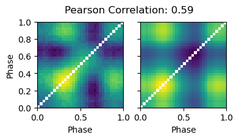

# Blind Source Separation for Decomposing X-ray Pulsar Profiles: Introducing Phase Correlated Variability Analysis (PCVA)
This repository contains a complete example of Phase Correlated Variability Analysis (PCVA) to decompose the pulse profiles of X-ray pulsars on simulated data. It accompanies the paper "Blind Source Separation for Decomposing X-ray Pulsar Profiles: Introducing Phase Correlated Variability Analysis (PCVA)", which is currently under review by the journal Astronomy & Astrophysis.

The main file is the Python Jupyter notebook `pcva-simulation-AA.ipynb`, which requires the file `smooth.py`, which in turn is licensed according to the contents of `LICENSE-smooth.txt`. The `environment.yml` file contains the environment with all packages and versions needed to run the notebook.

---
The aim of `pcva-simulation-AA.ipynb` is to recover two weights from a mixed signal using the newly developed PCVA method. To show how this works, the notebook provides a step-by-step example of the method using simulated data. In this example, the total 'observed' pulse profile is shown in red in the following figure. This profile is made up of the two weights (aka single-pole pulse profiles) shown as solid blue and green lines. The initial reconstruction is shown as dashed lines, and the relative scaling is recovered by exploiting the properties of the correlation matrix (i.e. a matrix correlating the light curves in different phase bins). The final result, including this rescaling, is shown as dotted blue and green lines:

(Total pulse profile in red. Input of the simulation: solid blue and green lines. Decomposition result: dotted blue and green lines.)

As can be seen, the recovery is very close to the input of the simulations. However, in order to use this method on real data, where the original weights are completely unknown, an additional figure of merit is needed that compares the output of the PCVA with the correlation properties of the observations. To do this, we compute a self-correlation matrix and compare this to the observed correlation matrix using the Pearson correlation coefficient:

This number can also be calculated for real data, and if it is comparable, it can be taken as evidence that the main correlation features of the observations have been successfully recovered by the decomposition.

---
We encourage the reader to take the `pcva-simulation-AA.ipynb` notebook and experiment with the decomposition parameters to assess convergence. We also suggest testing different simulation input weights by changing the random seed. The reader can also change other simulation parameters, such as the underlying signal distributions, to evaluate the robustness of the method and confirm its validity.
